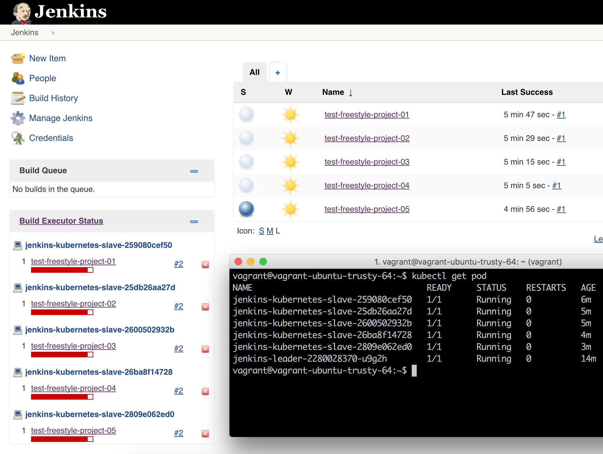
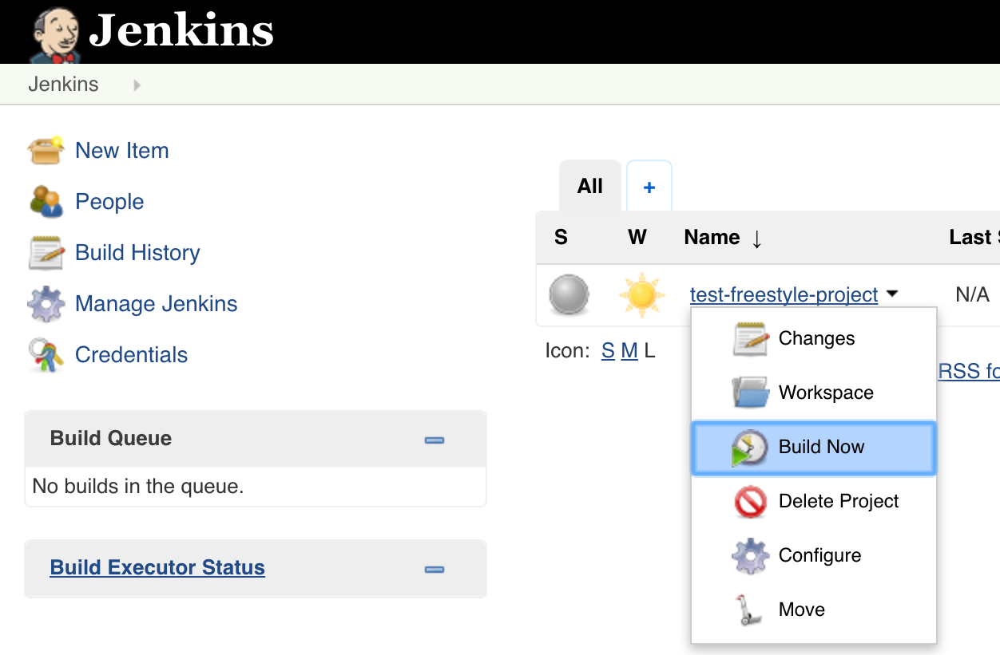
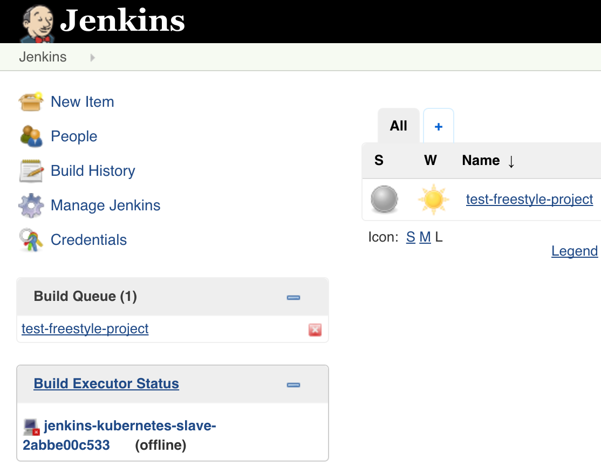
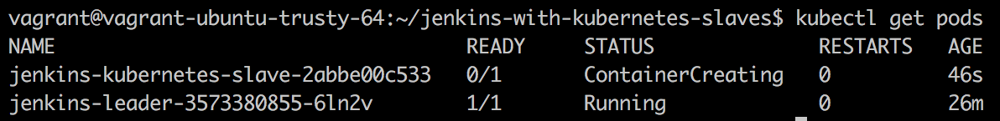
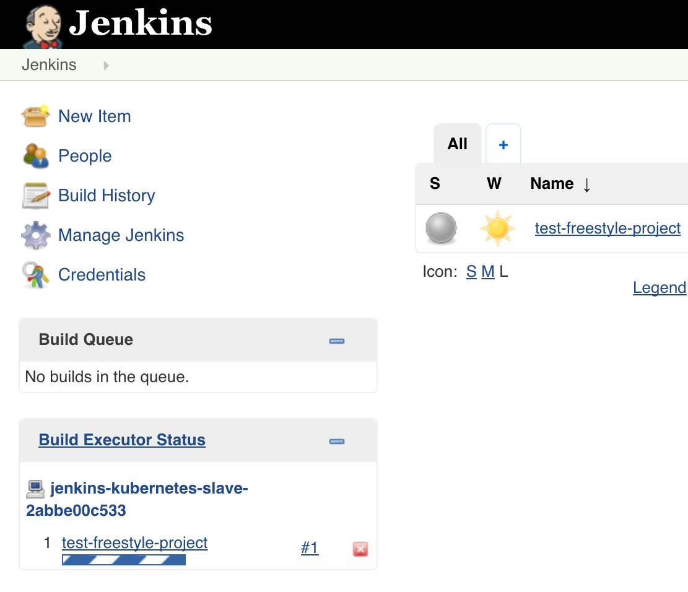

# Continuous Integration with Dynamically Provisioned Jenkins Slaves in a Kubernetes Cluster on AWS



Integrating [Jenkins](https://jenkins.io/) with [Kubernetes](http://kubernetes.io/) using the [Kubernetes plugin](https://wiki.jenkins-ci.org/display/JENKINS/Kubernetes+Plugin) provides several key benefits. No longer are you required to maintain a static pool of Jenkins slaves and have those resources sitting idle when no jobs are being run. The Kubernetes plugin will orchestrate the creation and tear-down of Jenkins slaves on-demand when jobs are being run. This is of course easier to manage, optimizes your resource usage, and makes it possible to share resources with an existing Kubernetes cluster running other workloads.

The following guide will first take you through the steps to create a Kubernetes cluster in AWS using [Kops](https://github.com/kubernetes/kops/), which is a newer solution for easily deploying a production ready Kubernetes cluster on AWS.

Once the Kubernetes cluster is available, we will then deploy Jenkins with the Kubernetes plugin configured to launch Jenkins slaves as Kubernetes pods on-demand.

**Warning:** Running the commands in this blog post will create AWS resources that may cost you money.

# Preparation of Local Environment

This section will guide you through the preparation of  your local environment if you chose to provision the cluster from your machine. As an alternative, you can skip ahead to the [Using Vagrant](#using-vagrant) section which will let you create a virtual machine with everything you need already installed.

### Prerequisites

1. An AWS account

2. The AWS CLI [installed](http://docs.aws.amazon.com/cli/latest/userguide/installing.html), [configured](http://docs.aws.amazon.com/cli/latest/userguide/cli-chap-getting-started.html) with a default region, and the security credentials of an [IAM user](http://docs.aws.amazon.com/cli/latest/userguide/cli-chap-getting-set-up.html) which has the `AdministratorAccess` [policy attached](http://docs.aws.amazon.com/IAM/latest/UserGuide/access_policies_managed-using.html#policies_using-managed-console).

    **Note:** The `AdministratorAccess` policy is used for this demo for simplicity purposes. In a production environment, you may want to configure more granular permissions for the IAM user account.

    Install the AWS CLI:

    ```
    wget https://s3.amazonaws.com/aws-cli/awscli-bundle.zip
    unzip awscli-bundle.zip
    sudo ./awscli-bundle/install -i /usr/local/aws -b /usr/local/bin/aws
    ```

    Configure the AWS CLI (Method #1 - AWS Configure):

    ```
    aws configure # Follow instructions
    ```

    Configure AWS CLI (Method #2 - ENV Variables):

    ```
    export AWS_ACCESS_KEY_ID="Your-AWS-IAM-User-Access-Key-ID"
    export AWS_SECRET_ACCESS_KEY="Your-AWS-IAM-User-Secret-Access-Key"
    export AWS_DEFAULT_REGION="Your-AWS-Default-Region"
    ```

3. An AWS EC2 key pair [created](http://docs.aws.amazon.com/AWSEC2/latest/UserGuide/ec2-key-pairs.html#having-ec2-create-your-key-pair) and the corresponding [public key file](http://docs.aws.amazon.com/AWSEC2/latest/UserGuide/ec2-key-pairs.html#retrieving-the-public-key) on your local machine (default path is: `~/.ssh/id_rsa.pub`).

4. A DNS hosted zone [created](http://docs.aws.amazon.com/Route53/latest/DeveloperGuide/CreatingHostedZone.html) in Route53 (e.g. yourdomain.com). This is a **requirement** for Kops to create the Kubernetes cluster. For more details, refer to the [Bringing up a cluster on AWS](https://github.com/kubernetes/kops/blob/master/docs/aws.md) document in the Kops repository.

5. A working [Go environment](https://golang.org/doc/install) with your `GOPATH` set properly.

    Install Go:

    ```
    wget https://storage.googleapis.com/golang/go1.7.1.linux-amd64.tar.gz
    sudo tar -C /usr/local -xzf go1.7.1.linux-amd64.tar.gz
    ```

    Set the required paths for Go:

    ```
    export PATH=$PATH:/usr/local/go/bin
    export GOPATH="Your-Go-Projects-Directory"
    export PATH=$PATH:${GOPATH}/bin
    ```

6. Docker [installed](https://docs.docker.com/engine/installation/)

7. Git [installed](https://git-scm.com/book/en/v2/Getting-Started-Installing-Git)

8. Jq [installed](https://stedolan.github.io/jq/download/)

### Install Kubectl

```
wget https://storage.googleapis.com/kubernetes-release/release/v1.4.5/bin/linux/amd64/kubectl
sudo chmod +x kubectl
sudo mv kubectl /usr/local/bin/kubectl
```

### Install Kops

Build the code (make sure you have set your GOPATH):

```
go get -d k8s.io/kops
cd ${GOPATH}/src/k8s.io/kops/
make
```

### Clone the repository

```
git clone https://github.com/smesch/jenkins-with-kubernetes-slaves.git
cd jenkins-with-kubernetes-slaves
```

Now that your local environment is prepared, you can skip ahead to the [Update the variables.sh Script](#update-the-variablessh-script) section.

# Using Vagrant

### Prerequisites

1. An AWS account

2. AWS environment variables set for default region & security credentials of an [IAM user](http://docs.aws.amazon.com/cli/latest/userguide/cli-chap-getting-set-up.html) which has the `AdministratorAccess` [policy attached](http://docs.aws.amazon.com/IAM/latest/UserGuide/access_policies_managed-using.html#policies_using-managed-console).

    **Note:** The `AdministratorAccess` policy is used for this demo for simplicity purposes. In a production environment, you will want to configure more granular permissions for the IAM user account.

      ```
      export AWS_ACCESS_KEY_ID="Your-AWS-IAM-User-Access-Key-ID"
      export AWS_SECRET_ACCESS_KEY="Your-AWS-IAM-User-Secret-Access-Key"
      export AWS_DEFAULT_REGION="Your-AWS-Default-Region"
      ```

3. An AWS EC2 key pair [created](http://docs.aws.amazon.com/AWSEC2/latest/UserGuide/ec2-key-pairs.html#having-ec2-create-your-key-pair) and the corresponding [public key file](http://docs.aws.amazon.com/AWSEC2/latest/UserGuide/ec2-key-pairs.html#retrieving-the-public-key) on your local machine (default path is: `~/.ssh/id_rsa.pub`)

4. A DNS hosted zone [created](http://docs.aws.amazon.com/Route53/latest/DeveloperGuide/CreatingHostedZone.html) in Route53 (e.g. yourdomain.com). This is a **requirement** for Kops to create the Kubernetes cluster. For more details, refer to the [Bringing up a cluster on AWS](https://github.com/kubernetes/kops#bringing-up-a-cluster-on-aws) section in the official Kops repository README.

5. [Vagrant](https://www.vagrantup.com/docs/installation/) and [VirtualBox](https://www.virtualbox.org/wiki/Downloads/) installed

6. Git [installed](https://git-scm.com/book/en/v2/Getting-Started-Installing-Git)

### Clone the Repository

```
git clone https://github.com/smesch/jenkins-with-kubernetes-slaves.git
cd jenkins-with-kubernetes-slaves
```

### Vagrantfile

If the local path to your AWS EC2 key pair public key file is not the default (`~/.ssh/id_rsa.pub`), you will need to update the `aws_keypair_pub_key_path` variable in the Vagrantfile:

```
aws_keypair_pub_key_path = "~/.ssh/id_rsa.pub"
```

### Boot and Connect to the Vagrant Virtual Machine

Run the following from the root of the repository where the Vagrantfile is located:

```
vagrant up
```

The provisioning of the Vagrant environment will take approximately 10 minutes, during which the following is happening:

1. The AWS environment variables `$AWS_ACCESS_KEY_ID`, `$AWS_SECRET_ACCESS_KEY`, `$AWS_DEFAULT_REGION` defined on the host are set on the guest

2. The AWS EC2 key pair public key file is copied from the host to the guest

3. Git is installed and the repository is cloned on the guest

4. The `/scripts/provision-vagrant.sh` script is run, which installs unzip, jq, go, Kops, the AWS CLI, Docker, and kubectl

Once the Vagrant virtual machine is started, run the following command to connect to it and then move into the root of the repository:

```
vagrant ssh
cd jenkins-with-kubernetes-slaves
```

# Update the Variables.sh Script

Once you have setup your local environment or provisioned and logged into your Vagrant environment, you will need to update the [`/scripts/variables.sh`](https://github.com/smesch/jenkins-with-kubernetes-slaves/blob/master/scripts/variables.sh) script with your specific details:

```
# Set values for variables
export AWS_REGION="us-east-1"
export AWS_AVAIL_ZONE="us-east-1b"
export DOMAIN_NAME="jenkins.kubernetes.yourdomain.com"
export CLUSTER_MASTER_SIZE="t2.micro"
export CLUSTER_NODE_SIZE="t2.micro"
export JENKINS_DOCKER_IMAGE="smesch/jenkins-kubernetes-leader-custom:2.32.3"
export AWS_KEYPAIR_PUB_KEY_PATH="~/.ssh/id_rsa.pub"

# Set KOPS_STATE_STORE to S3 bucket name (leave as-is)
export KOPS_STATE_STORE="s3://${DOMAIN_NAME}"
```

* `AWS_REGION` &mdash; AWS region where the Kubernetes cluster will be provisioned (default: us-east-1)
* `AWS_AVAIL_ZONE` &mdash; AWS availability zone where the Kubernetes cluster will be provisioned (default: us-east-1b)
* `DOMAIN_NAME` &mdash; Your domain name that is hosted in Route53, where the DNS records for the Kubernetes cluster will be created. This **value must be updated** with your own domain; otherwise Kops will fail to create the Kubernetes cluster.
* `CLUSTER_MASTER_SIZE` &mdash; EC2 instance size of the single master instance that will be created for the Kubernetes cluster (default: t2.micro)
* `CLUSTER_NODE_SIZE` &mdash; EC2 instance size of the two node instances that will be created for the Kubernetes cluster (default: t2.micro)
* `JENKINS_DOCKER_IMAGE` &mdash; Docker image that will be used for the Jenkins leader. Change this only if you are using a customized Docker image for Jenkins
* `AWS_KEYPAIR_PUB_KEY_PATH` &mdash; Leave as-is if you are using Vagrant. If running locally, update this if your AWS EC2 key pair public key file is not located at `~/.ssh/id_rsa.pub`
* `KOPS_STATE_STORE` &mdash; Leave as-is, will set the S3 bucket url to the domain you specified for the DOMAIN_NAME variable

**Note:** For the purpose of the demo and to keep the AWS costs down, the default instance size for the master and node instances is t2.micro. In a production environment, you would want to use larger instance sizes.

# Create the Kubernetes Cluster

Once you have updated the `variables.sh` script, you can then proceed to create the Kubernetes cluster by launching the [`/scripts/create-cluster.sh`](https://github.com/smesch/jenkins-with-kubernetes-slaves/blob/master/scripts/create-cluster.sh) script. The script must be launched from the root of the repository:

```
$ ./scripts/create-cluster.sh
{
    "Location": "/jenkins.kubernetes.c3group.io"
}
I0926 17:56:37.614045   24007 cluster.go:362] Assigned CIDR 172.20.64.0/19 to zone us-east-1b
I0926 17:56:37.944348   24007 cluster.go:338] Using kubernetes latest stable version: v1.3.7
...
...
```

### Contents of the create-cluster.sh Script

```
# Load variables from variables.sh script
source ./scripts/variables.sh

# Create the S3 bucket used for Kubernetes cluster configuration storage
aws s3api create-bucket --region ${AWS_REGION} --bucket ${DOMAIN_NAME}

# Create the Kubernetes cluster
kops create cluster --master-size=${CLUSTER_MASTER_SIZE} --node-size=${CLUSTER_NODE_SIZE} --cloud=aws --zones=${AWS_AVAIL_ZONE} --ssh-public-key=${AWS_KEYPAIR_PUB_KEY_PATH} ${DOMAIN_NAME}
kops update cluster ${DOMAIN_NAME} --yes
```

* The variables that you defined in the `/scripts/variables.sh` script are loaded
* The AWS S3 bucket is created with the domain you specified for the `DOMAIN_NAME` variable
* Kops commands are run to provision the Kubernetes cluster

The creation of the Kubernetes cluster will take about 5 &mdash; 7 minutes. To verify that the cluster was created successfully, you can run the following command to verify that the nodes are reporting a "Ready" status:

```
$ kubectl get nodes
NAME                            STATUS                     AGE
ip-172-20-77-12.ec2.internal    Ready,SchedulingDisabled   7m
ip-172-20-78-169.ec2.internal   Ready                      7m
ip-172-20-78-170.ec2.internal   Ready                      7m
```

# Deploy Jenkins to the Cluster

Once you have created the cluster and the three instances are reporting a "Ready" status, you can then proceed to deploy the Jenkins leader to the Kubernetes cluster by launching the [`/scripts/deploy-jenkins.sh`](https://github.com/smesch/jenkins-with-kubernetes-slaves/blob/master/scripts/deploy-jenkins.sh) script. The script must be launched from the root of the repository:

```
$ ./scripts/deploy-jenkins.sh
deployment "jenkins-leader" created
persistentvolumeclaim "jenkins-leader-pvc" created
persistentvolume "jenkins-leader-pv" created
service "jenkins-leader-svc" created
```

The creation of the Jenkins leader will take about 5 minutes.

### Contents of the deploy-jenkins.sh Script

```
# Load variables from variables.sh script
source ./scripts/variables.sh

# Check if there is already a volume available in AWS EC2 with a Name tag value of "jenkins-kubernetes-volume"
export JENKINS_KUBERNETES_VOLUME_CHECK=$(aws ec2 describe-volumes --region ${AWS_REGION} --filters Name=tag-key,Values="Name" Name=tag-value,Values="jenkins-kubernetes-volume" --output text --query 'Volumes[*].VolumeId')

# Create an AWS EC2 volume for Jenkins and replace the VolumeID in the jenkins-kubernetes-leader-per-vol.yaml file
if [[ -z "$JENKINS_KUBERNETES_VOLUME_CHECK" ]]; then
    export JENKINS_KUBERNETES_VOLUME=$(aws ec2 create-volume --region ${AWS_REGION} --availability-zone ${AWS_AVAIL_ZONE} --size 32 --volume-type gp2 | jq -r ".VolumeId")
    aws ec2 create-tags --region ${AWS_REGION} --resources $JENKINS_KUBERNETES_VOLUME --tags Key=Name,Value=jenkins-kubernetes-volume
    sed -i -e "s/vol-.*/$JENKINS_KUBERNETES_VOLUME/g" ./kubernetes/jenkins-kubernetes-leader-per-vol.yaml
fi

# Set Jenkins Docker image name in the jenkins-kubernetes-leader-deploy.yaml file
sed -i -e "s|image: .*|image: $JENKINS_DOCKER_IMAGE|g" ./kubernetes/jenkins-kubernetes-leader-deploy.yaml

# Create Kubernetes objects
kubectl create -f ./kubernetes
```

* The variables that you defined in the `/scripts/variables.sh` script are loaded
* It checks whether an AWS EBS volume with a name tag of "jenkins-kubernetes-volume" has already been created and is available
* If no AWS EBS volume with a name tag of "jenkins-kubernetes-volume" is available, it will create it
* This volume will be used as the persistent volume for the Jenkins leader, which will ensure that the Jenkins configuration is not lost if the Jenkins leader pod in Kubernetes crashes or is rescheduled on another node
* The AWS EBS VolumeID is written to the `/kubernetes/jenkins-kubernetes-leader-per-vol.yaml` Kubernetes manifest, which will be used to define the persistent volume for the Jenkins leader
* The Docker image that you specified for the `JENKINS_DOCKER_IMAGE` variable is written to the `/kubernetes/jenkins-kubernetes-leader-deploy.yaml` Kubernetes manifest
* The Kubernetes manifests for the Jenkins leader, which are located in the [/kubernetes/](https://github.com/smesch/jenkins-with-kubernetes-slaves/tree/master/kubernetes) directory, will be applied to the cluster

### Kubernetes Manifests

The resources specified in the following Kubernetes manifests will be created for the Jenkins leader:

* [`jenkins-kubernetes-leader-per-vol.yaml`](https://github.com/smesch/jenkins-with-kubernetes-slaves/blob/master/kubernetes/jenkins-kubernetes-leader-per-vol.yaml): Creates a [persistent volume](http://kubernetes.io/docs/user-guide/persistent-volumes/#persistent-volumes) that is backed by the AWS EBS volume that was created by the `deploy-jenkins.sh` script
* [`jenkins-kubernetes-leader-per-vol-claim.yaml`](https://github.com/smesch/jenkins-with-kubernetes-slaves/blob/master/kubernetes/jenkins-kubernetes-leader-per-vol-claim.yaml): Creates a [persistent volume claim](http://kubernetes.io/docs/user-guide/persistent-volumes/#persistentvolumeclaims) and assigns it to the Jenkins leader deployment
* [`jenkins-kubernetes-leader-deploy.yaml`](https://github.com/smesch/jenkins-with-kubernetes-slaves/blob/master/kubernetes/jenkins-kubernetes-leader-deploy.yaml): Creates the Jenkins leader [deployment](http://kubernetes.io/docs/user-guide/deployments/), which specifies which Docker image to run (specified in the `variables.sh` script), the ports to be exposed (8080 for the web UI and 50000 for Jenkins slave communication), and the directory (`/var/jenkins_home`) to mount in the persistent volume
* [`jenkins-kubernetes-leader-svc.yaml`](https://github.com/smesch/jenkins-with-kubernetes-slaves/blob/master/kubernetes/jenkins-kubernetes-leader-svc.yaml): Creates a LoadBalancer type [service](http://kubernetes.io/docs/user-guide/services/) which exposes ports 80 (proxied to 8080) & 50000 externally

# Using Jenkins

### Accessing the Jenkins Web UI

To obtain the URL for the Jenkins Web UI, run the following command, copy the value for "LoadBalancer Ingress", and paste it into a browser.

```
$ kubectl describe svc jenkins-leader-svc
Name:			jenkins-leader-svc
Namespace:		default
Labels:			run=jenkins-leader
Selector:		run=jenkins-leader
Type:			LoadBalancer
IP:			100.64.46.174
LoadBalancer Ingress:	a6bea4c3a841511e6ac380ecbb58edf9-27725344.us-east-1.elb.amazonaws.com
Port:			http	80/TCP
NodePort:		http	32425/TCP
Endpoints:		100.96.1.3:8080
Port:			slave	50000/TCP
NodePort:		slave	31510/TCP
Endpoints:		100.96.1.3:50000
Session Affinity:	None
No events.
```

**NOTE:** Jenkins authentication is turned off for this demo for simplicity purposes. In a production environment, you will want to configure authentication for Jenkins.

### Run the Test Job in Jenkins

To verify that the Kubernetes plugin is working properly, you can run the test job named "test-freestyle-project" that is included with the Jenkins Docker image. To run the job, click the arrow next to the job name on the dashboard and choose "Build Now":



Shortly after you start the job, you should see a new Jenkins slave being created in the "Build Executor Status" section on the dashboard:



You can also see the corresponding Kubernetes pod getting created by running "kubectl get pods":



Finally, you will see the newly created Jenkins slave running the job in the "Build Executor Status" section on the dashboard:



# Delete the Kubernetes Cluster

You can delete the Kubernetes cluster by launching the [`/scripts/delete-cluster.sh`](https://github.com/smesch/jenkins-with-kubernetes-slaves/blob/master/scripts/delete-cluster.sh) script. The script must be launched from the root of the repository:

```
$ ./scripts/delete-cluster.sh
TYPE			NAME										ID
autoscaling-config	master-us-east-1b.masters.jenkins.kubernetes.c3group.io-20160930144921		master-us-east-1b.masters.jenkins.kubernetes.c3group.io-20160930144921
autoscaling-config	nodes.jenkins.kubernetes.c3group.io-20160930145013				nodes.jenkins.kubernetes.c3group.io-20160930145013
autoscaling-group	master-us-east-1b.masters.jenkins.kubernetes.c3group.io				master-us-east-1b.masters.jenkins.kubernetes.c3group.io
...
...
```

### Contents of the delete-cluster.sh Script

```
# Load variables from variables.sh script
source ./scripts/variables.sh

# Delete the Kubernetes cluster
kops delete cluster ${DOMAIN_NAME} --yes

# Wait for Kubernetes cluster instances to be fully terminated
sleep 60

# Delete the persistent volume used for Jenkins
export JENKINS_KUBERNETES_VOLUME=$(aws ec2 describe-volumes --region ${AWS_REGION} --filters Name=tag-key,Values="Name" Name=tag-value,Values="jenkins-kubernetes-volume" --output text --query 'Volumes[*].VolumeId')
aws ec2 delete-volume --region ${AWS_REGION} --volume-id $JENKINS_KUBERNETES_VOLUME

# Delete the S3 bucket used for Kubernetes cluster configuration storage
aws s3api delete-bucket --region ${AWS_REGION} --bucket ${DOMAIN_NAME}
```

* The variables that you defined in the `/scripts/variables.sh` script are loaded
* `Kops delete cluster` is run to delete the Kubernetes cluster
* It pauses for 60 seconds for the Kubernetes cluster instances to be fully terminated
* The AWS EC2 VolumeID of the Jenkins leader persistent volume is obtained and then used to delete the volume
* The AWS S3 bucket is deleted
